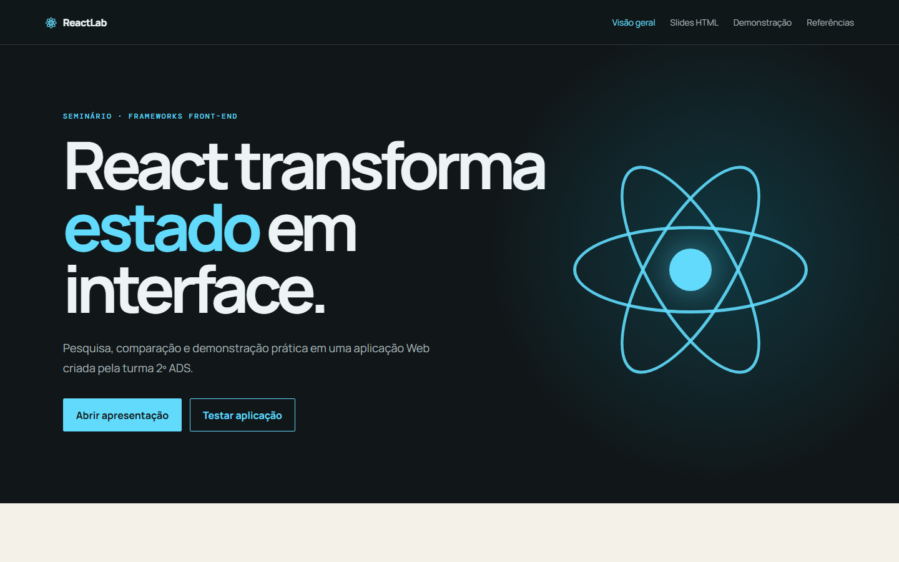
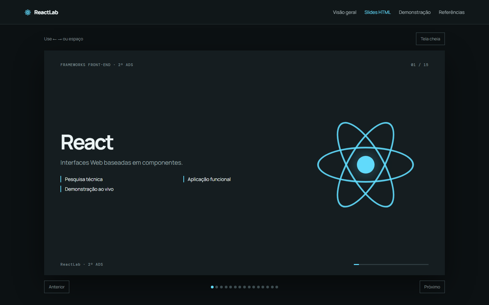
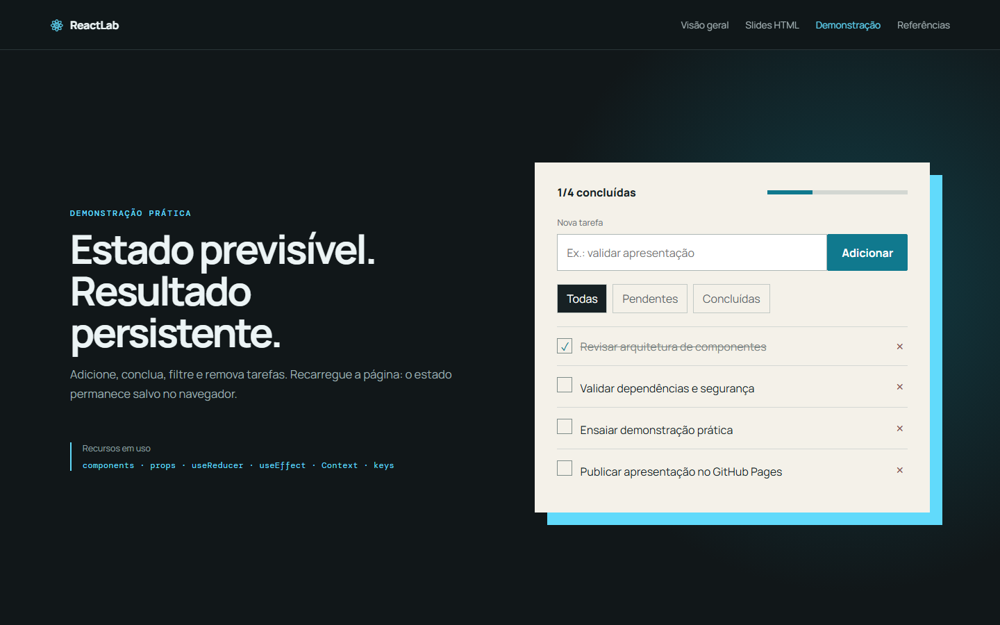
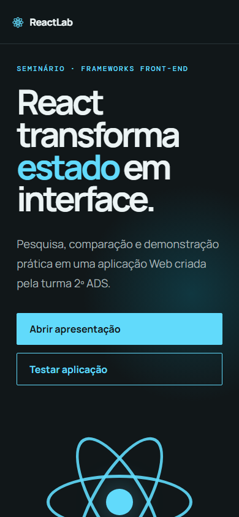

# ReactLab — Seminário React

Aplicação Web do seminário de React da turma 2º ADS. O projeto reúne uma página pública com a pesquisa, uma apresentação HTML e um quadro de tarefas funcional para a demonstração prática.

## Integrantes

- João Gabriel
- João Pedro Fonseca
- Lucas Souza
- Miguel Oliveira
- Davi Souza
- Lucca Castilho
- Pedro de Lima
- Renan Ramos

## Tecnologia e versões

- React e React DOM 19.3.0
- TypeScript 7.0.2
- Vite 8.3.0
- React Router DOM 7.18.4

## Pré-requisitos

- Node.js 20.19 ou superior, ou 22.12 ou superior
- npm
- Navegador atualizado

## Instalação e execução

```bash
git clone https://github.com/luccalck/seminario-react-2ads.git
cd seminario-react-2ads
npm ci
npm run dev
```

O terminal informa a URL local, normalmente `http://localhost:5173`.

Para validar e testar a versão de produção:

```bash
npm test -- --run
npm run build
npm run preview
```

## Estrutura do projeto

```text
src/
├─ components/     elementos reutilizáveis e quadro de tarefas
├─ context/        estado, reducer, persistência e testes
├─ data/           conteúdo e referências do seminário
├─ pages/          visão geral, slides, demonstração e fontes
├─ App.tsx         rotas e estrutura principal
├─ main.tsx        entrada da aplicação React
└─ styles.css      identidade visual e responsividade
.github/workflows/ deploy automático no GitHub Pages
tools/             gerador do PowerPoint
```

## Funcionalidades

- Conteúdo essencial do seminário em uma página pública
- Apresentação HTML com 15 slides e navegação por teclado
- Inclusão, conclusão, filtragem e exclusão de tarefas
- Persistência das tarefas em `localStorage`
- Rotas declarativas com `HashRouter`
- Layout responsivo para desktop e celular

## Recursos React demonstrados

- Componentes e props
- JSX e renderização condicional
- Listas com chaves estáveis
- Context e `useReducer` para estado compartilhado
- `useEffect` para sincronização com `localStorage`
- Rotas declarativas

O fluxo do quadro é direto: o componente envia uma ação, o reducer calcula o próximo estado, o React renderiza a interface e o effect persiste a nova lista.

## Vulnerabilidade pesquisada

### CVE-2025-55182

A vulnerabilidade permite execução remota de código sem autenticação em aplicações com React Server Components. Ela afeta os pacotes `react-server-dom-webpack`, `react-server-dom-parcel` e `react-server-dom-turbopack` nas versões 19.0.0, 19.1.0, 19.1.1 e 19.2.0. A correção inicial foi publicada nas versões 19.0.1, 19.1.2 e 19.2.1.

A mitigação é atualizar imediatamente React, os pacotes `react-server-dom-*` e o framework ou bundler que habilita RSC, executar auditoria e reconstruir a aplicação. Este projeto usa Vite somente no cliente e não instala React Server Components, portanto não é diretamente afetado.

Fonte: [React — Critical Security Vulnerability in React Server Components](https://react.dev/blog/2025/12/03/critical-security-vulnerability-in-react-server-components).

## Evidências









## GitHub Pages

[Abrir a aplicação publicada](https://luccalck.github.io/seminario-react-2ads/)

## Repositório

[Código-fonte público](https://github.com/luccalck/seminario-react-2ads)

## Referências

- [React — Quick Start](https://react.dev/learn)
- [React — Versions](https://react.dev/versions)
- [React 19.3](https://react.dev/blog/2026/09/09/react-19-3)
- [React Foundation](https://react.dev/blog/2026/02/24/the-react-foundation)
- [Build a React app from Scratch](https://react.dev/learn/build-a-react-app-from-scratch)
- [Vite — Getting Started](https://vite.dev/guide/)
- [React Hooks](https://react.dev/reference/react/hooks)
- [Meta — Introducing the React Foundation](https://engineering.fb.com/2025/10/07/open-source/introducing-the-react-foundation-the-new-home-for-react-react-native/)
- [GitHub Pages](https://docs.github.com/en/pages/getting-started-with-github-pages/configuring-a-publishing-source-for-your-github-pages-site)
- [React Router — HashRouter](https://reactrouter.com/api/declarative-routers/HashRouter)

## Licença

Material acadêmico produzido para a disciplina de Frameworks Front-end.
